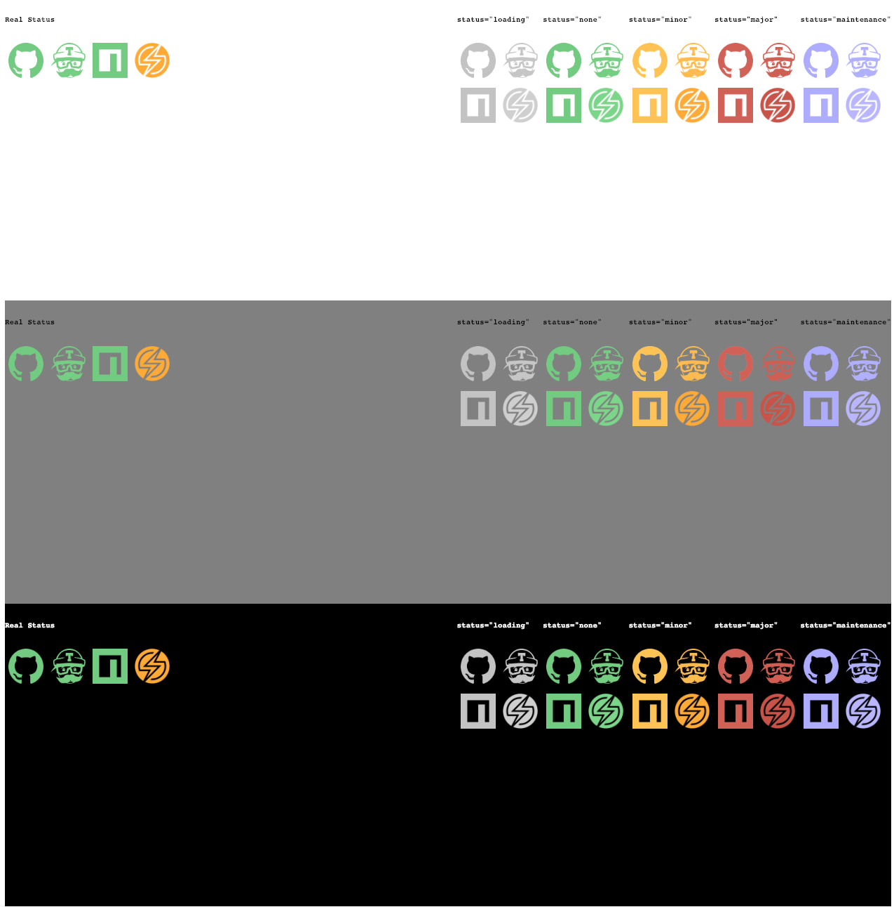

# service-indicators-react

```jsx
render () {
  return (
    <div>
      <ServiceIndicatorIcon service="github"/>
      <ServiceIndicatorIcon service="travis-ci"/>
      <ServiceIndicatorIcon service="npm"/>
      <ServiceIndicatorIcon service="sauce-labs"/>
    </div>
  )
}
```

